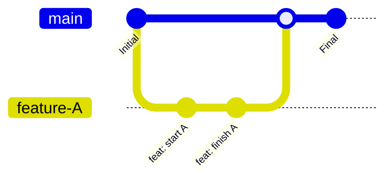

# Workflows Types pour Analystes

Cette section décrit les workflows Git et DVC les plus courants pour un projet d'analyse de données, avec des diagrammes pour illustrer les concepts.

---

## 1. Workflow Solo Basique

C'est le cycle de base pour travailler seul sur un projet.

**Objectif** : Modifier le code, sauvegarder les changements, et les pousser sur GitHub.

```mermaid
graph TD
    A[Start] --> B{Fichiers locaux modifiés};
    B --> C{git status};
    C --> D[git add .];
    D --> E[git commit -m "Message"];
    E --> F[git push origin main];
    F --> G[Code sauvegardé sur GitHub];
    G --> A;
```

**Étapes :**
1.  Vous modifiez vos fichiers (scripts, notebooks).
2.  Vous utilisez `git add` pour sélectionner les changements à sauvegarder.
3.  Vous utilisez `git commit` pour créer un checkpoint avec un message clair.
4.  Vous utilisez `git push` pour envoyer vos checkpoints sur GitHub.

---

## 2. Workflow Mensuel (Mise à jour des Données)

Ce workflow combine Git et DVC pour mettre à jour un jeu de données volumineux.

**Objectif** : Versionner une nouvelle version d'un fichier de données sans alourdir Git.

```mermaid
graph TD
    subgraph "Étape 1: Mise à jour locale"
        A[Nouvelles données reçues] --> B[Remplacer l'ancien fichier CSV];
        B --> C{dvc status};
        C --> D[dvc add data/raw/mon_fichier.csv];
    end

    subgraph "Étape 2: Commit du Pointeur"
        E[git add data/raw/mon_fichier.csv.dvc] --> F[git commit -m "data: update monthly sales"];
    end

    subgraph "Étape 3: Push sur les deux remotes"
        G[dvc push] --> H[Données envoyées sur Google Drive];
        I[git push] --> J[Code (pointeur) envoyé sur GitHub];
    end

    A --> B;
    D --> E;
    F --> G;
    F --> I;
```

**Étapes :**
1.  Vous remplacez le fichier de données localement (ex: `ventes.csv`).
2.  `dvc add` met à jour le hash du fichier.
3.  `git commit` enregistre le changement du *pointeur* DVC (un petit fichier texte).
4.  `dvc push` envoie le *vrai fichier de données* sur le stockage distant (ex: Google Drive).
5.  `git push` envoie le *pointeur* sur GitHub.

---

## 3. Workflow d'Équipe avec Branches

C'est le workflow standard pour collaborer à plusieurs sur un même projet.

**Objectif** : Développer une nouvelle fonctionnalité sur une branche isolée pour ne pas perturber la branche principale (`main`).



**Étapes :**
1.  **`git pull`** : Assurez-vous d'avoir la version la plus à jour de `main`.
2.  **`git checkout -b nom-de-ma-feature`** : Créez une nouvelle branche et basculez dessus.
3.  **Travaillez et commitez** sur cette branche. Vous êtes isolé, vous ne pouvez rien casser sur `main`.
4.  **`git push origin nom-de-ma-feature`** : Poussez votre branche sur GitHub.
5.  **Ouvrez une Pull Request (PR)** : Sur GitHub, demandez à fusionner votre branche dans `main`.
6.  **Revue de code** : Vos collègues commentent votre code. Vous apportez des modifications si nécessaire.
7.  **Merge** : Une fois la PR approuvée, vous la fusionnez. La branche `main` est maintenant mise à jour avec votre travail.
